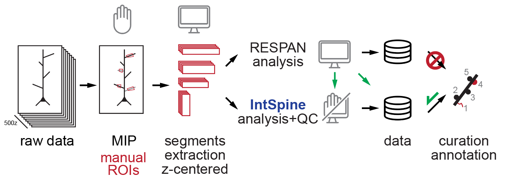
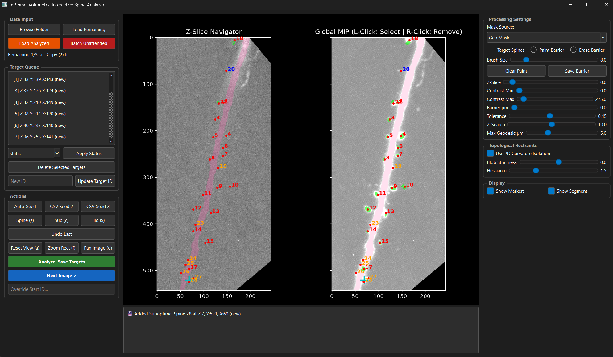

<<<<<<< HEAD
#   `IntSpine`: <br>   `Int`eractive `Spine` Analysis Tool
=======
#   IntSpine: Interactive Spine Analysis Tool
>>>>>>> f6abc54c0ea679db32f9ab9b5de46ee8572520a0
 

## Overview
This repository contains a standalone Python desktop application (PySide6) and associated tools for volumetric spine quantification from z-stack images. It was developed to benchmark automated solutions against ground truth data, as existing tools were not optimal for high-resolution datasets. 

The application enables the easy extraction of volumes from z-stacks, facilitating manual annotation, eliminating z-axis bleeding, and improving data traceability.


*Example of spine analysis workflow*

## Features & Rationale
Processing pipeline designed to:
*   **Improve data traceability** for rigorous quantitative microscopy.
*   **Enable automated processing and batching** of segments to be used with tools like RESPAN.
*   **Facilitate manual annotation** by rapidly loading isolated segments sequentially.
*   **Isolate morphology** using 2.5D extruded envelopes and 2D Hessian curvature filtering to completely prevent longitudinal shaft bleeding.

## Installation

This application requires a dedicated Conda environment 

**1. Create the Environment File**
Save the following configuration as `environment.yml` in your project 

**2. Build and Activate the Environment**
Open Anaconda Prompt and execute the following commands:

```bash
# Download the repository
git clone https://github.com/RumbaughLab/IntSpine.git

# Navigate to the repository
cd /path/to/IntSpine

# Create the environment
conda env create -f environment.yml

# Activate the environment
conda activate IntSpine
```

**3. Launch the Application**
```bash
python IntSpine_app.py
```

## Workflow


*IntSpine User Interface*

### 0. Pre-Processing & ROI Extraction
This step enables the extraction of images to implement batch processing and traceability of the data
1. Open a **z-max projection** of your z-stack. This is significantly faster to load than a full z-stack and makes it much easier to identify branches of interest.
2. Draw and save Regions of Interest (ROIs) on the z-projection (Fiji)
3. Run the automated extraction tool `tile_generation.ipynb`. *(Note: Loading the full image—e.g., 500 z-steps—takes about 1 minute, but this process runs entirely automatically).*
4. The tool will automatically extract and crop all ROIs in X, Y, and Z dimensions.

### 1. Tracing and Masking
Once the ROIs are cropped and extracted, loading them for labeling is  fast. Manual tracing and saving of the trace with SNT as swc format can be performed however this process is automated within IntSpine and is not require. In addition, traces or mask from other software can be uploaded as well.
1. Load the extracted ROI segments.
2. Trace the neurite using **SNT (Simple Neurite Tracer)**.
3. **Important Calibration**: Ensure the image is properly calibrated to the correct pixel/µm dimensions before tracing. 
4. **Diameter Masking**: While tracing the neurite, use the scroll wheel to adjust and capture the *actual diameter* of the dendrite. This trace acts as a spatial barrier during z-quantification.
5. Save the completed trace as an `.swc` file (or generate a Geo/Respan mask).

### 3. Volumetric Quantification (IntSpine App)
1. **Load Data:** Launch `IntSpine_app.py`. Click **Browse Folder** to select the directory containing your cropped `.tif` images and their corresponding masks/traces. Click **Load Remaining**.

2. **Select Mask Source:** Choose the appropriate barrier mask (`SWC Mask`, `Geo Mask`, or `Respan Mask`) from the dropdown. Adjust the **Barrier µm** slider to dilate or contract the dendritic exclusion zone.

3. **Generate Seed Targets:** Populate the target queue using one of three methods:
    *   **Manual Seeding:** Left-click on the Z-Slice Navigator or Global MIP. The algorithm automatically snaps to the optimal local Z-plane.
    *   **Auto-Seed:** Click the **Auto-Seed** button to automatically detect peaks using background subtraction and geodesic filtering.
    *   **CSV Import:** Click **CSV Seed 2** or **CSV Seed 3** to load external coordinate predictions (e.g., `*seeds_2-respan.csv`).
4. **Target Management:** 
    *   Right-click to remove erroneous seeds.
    *   Assign specific classifications to seeds using the **Spine (z)**, **Sub (c)**, or **Filo (x)** buttons.
    *   Update target tracking statuses (`static`, `new`, `eliminated`) using the Status dropdown.
    *   Manually refine the dendritic barrier by switching the mode to **Paint/Erase Barrier** to handle complex overlapping structures.
5. **Adjust Topological Restraints:** 
    *   To prevent the segmentation mask from bleeding down the dendrite shaft, ensure **Use 2D Curvature Isolation** is checked.
    *   Adjust the **Hessian σ** to match the macroscopic size of the spines (higher values for massive mushroom spines, lower for thin filopodia).
    *   Tune the **Blob Strictness** to control where the algorithm severs the spine neck.
6. **Batch Analysis:** Click **Analyze All Targets**. The tool uses a 2.5D Dilated Envelope Extrusion technique to accurately map 3D volume while physically preventing longitudinal shaft bleeding. Results are automatically saved to an `output_analysis` folder, including a detailed CSV report, a filtered `.tif`, the segmentation mask, and a labeled MIP overlay image.

## Examples
Example demonstration videos of the sandbox prototype of the pre-processing and UI workflow are available directly in this repository.

<<<<<<< HEAD
## Output
### Output File Descriptions

All automated outputs are saved within an `output_analysis/` subdirectory generated alongside your raw images. If the app is run in "Correction Mode" (loading already analyzed files), outputs are prefixed with `_corrected_` to prevent overwriting raw data.

*   `[base_name]_spine_results.csv`: The primary quantitative data ledger containing spatial coordinates, morphology metrics, and fluorescence intensities for every analyzed target in the image.
*   `[base_name]_segmentation_mask.tif`: A 3D 16-bit instance mask array. The background is `0`, and the voxels comprising each segmented spine hold the integer value of their respective `Target_ID`.
*   `[base_name]_filtered.tif`: The processed 3D image stack—after background subtraction, Gaussian smoothing, and dendritic shaft occlusion—used internally by the 2.5D region-growing algorithm. 
*   `[base_name]_mip_segmented.png`: A high-resolution 2D Maximum Intensity Projection (MIP) rendering overlaid with color-coded markers and Target IDs. Used for rapid visual quality control without needing to load 3D stacks.
*   `[base_name]_custom_barrier_2d.tif`: A 2D mask file storing any manual brush strokes made using the "Paint/Erase Barrier" modes, allowing custom morphological exclusions to persist across sessions.
*   `[base_name]_dendrite-geo.tif`: *(Saved in the raw image directory)* The automated binary mask of the main dendritic shaft, generated using the `Auto-Gen Barrier` geodesic backbone routing. 

---

### CSV Column Dictionary (`spine_results.csv`)

The tabular output provides comprehensive spatial and volumetric metrics for quantitative microscopy.

#### Target Identification & Classification
*   **`Target_ID`**: The unique integer identifier assigned to the target (matches the pixel values in the `_segmentation_mask.tif`).
*   **`Classification`**: The physiological classification of the target (`Spine`, `Filopodia`, or `Suboptimal Measures`).
*   **`Status`**: The temporal/tracking status assigned via the UI dropdown (`new`, `static`, or `eliminated`).

#### Spatial Coordinates
*   **`Z_Slice`**: The 1-indexed Z-plane where the peak intensity (optimal slice) was detected.
*   **`Original_X` / `Original_Y`**: The raw (X, Y) pixel coordinates initially clicked by the user or imported from a seed file.
*   **`Corrected_X` / `Corrected_Y`**: The optimized (X, Y) pixel coordinates after the algorithm snaps to the localized 3D intensity centroid.

#### Morphology & Volumetrics
*   **`Area_Opt_Z_um2`**: The cross-sectional area (in µm²) of the segmented spine mask specifically at its optimal Z-slice.
*   **`Vol_voxels`**: The absolute count of 3D pixels (voxels) contained within the entire segmented instance mask.
*   **`Vol_um3`**: The total physical volume of the spine in cubic micrometers (µm³), calibrated using the script's voxel dimensions.
*   **`Z_Slices_Count`**: The total number of individual Z-planes that the segmented spine structure spans.
*   **`Geodesic_Distance_um`**: The shortest traversable distance (in µm) from the spine's corrected centroid back to the boundary of the main dendritic shaft.
*   **`Dendrite_Length_um`**: The total length of the dendritic shaft (in µm) computed via the SWC skeleton or the auto-generated geodesic backbone.

#### Fluorescence Intensity Metrics
*   **`Max_Intensity`**: The absolute peak raw fluorescence value found anywhere within the 3D segmented spine boundary.
*   **`Sum_Intensity`**: The aggregate sum of all raw fluorescence intensities within the spine mask.
*   **`Integrated_Density`**: Equivalent to `Sum_Intensity` (provided for naming compatibility with standard ImageJ/Fiji workflows).
*   **`Local_Dendrite_Surface_Max`**: The peak fluorescence intensity specifically extracted from the edge of the dendritic shaft barrier adjacent to the current spine.
*   **`Local_Dendrite_Surface_IntDen`**: The integrated density of the local dendritic shaft surface footprint adjacent to the spine.
*   **`Avg_Initial_Dendrite_Intensity`**: The global mean fluorescence intensity computed across the entire primary dendritic shaft mask.

#### Algorithm Parameters (Traceability)
*   **`Barrier_um`**: The global exclusion distance (in µm) utilized to occlude the dendritic shaft prior to segmentation.
*   **`Tolerance`**: The fractional intensity drop-off boundary used to constrain the 3D region-growing algorithm.
*   **`Z_Search_Range`**: The ± Z-slice buffer constraint applied when scanning for the optimal geometric bounding box.

## TODO - Future Improvements
1. There are numerous opportunities for further development, including expanding this 2.5D framework into simpler, fully automated tools based on this manual ground-truth extraction pipeline.

2. Add the functionality of displaying side by side images or images overlay or image alignment for longitudinal studies

3. Can create an alignment process based on the segmented barrier

4. Make new videos witht the updated UI
=======
## Future Improvements
There are numerous opportunities for further development, including expanding this 2.5D framework into simpler, fully automated tools based on this manual ground-truth extraction pipeline.
>>>>>>> f6abc54c0ea679db32f9ab9b5de46ee8572520a0
